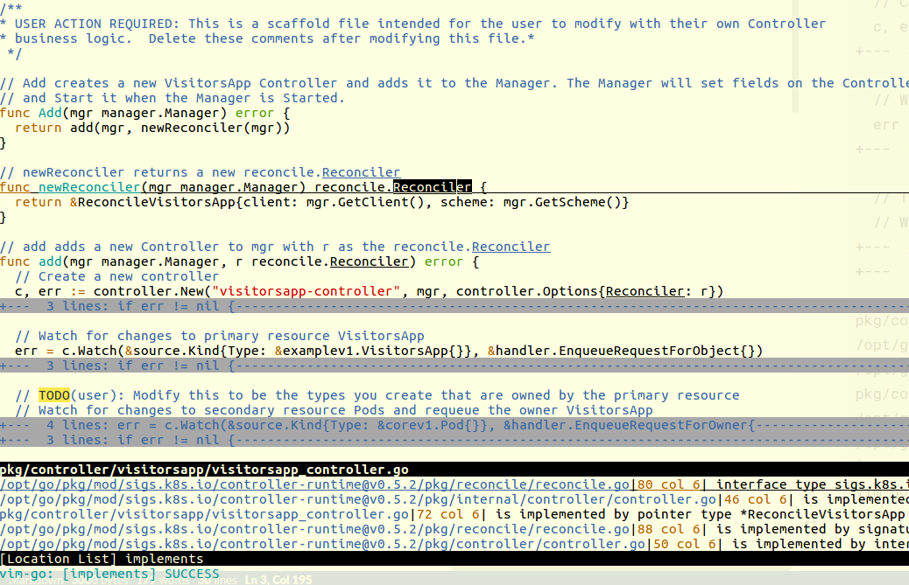

# A Linking Tool for Go Modules to Work With GoGuru

Linking cloned sources or extracted modules under GOPATH for Go Guru
to work with go modules AUTOMAGICALLY:
 * For each extracted pkg module by go tools, symlinks it from modules (or
   clones it from the discovered repo URL) into GOPATH. Use '-o' to
   allow symlinking modules over GOPATH contents (is destructive for repos!)
 * If the package is aliased to another repo, also creates a simlink for it:
   cloud.google.com/go -> github.com/googleapis/google-cloud-go
 * If a package is already in GOPATH, stashes cnahges, resets HEAD, then checks
   it out by the wanted version and tries to git pull, if in a branch.
 * For multi-packages in a single repo, the last processed package "wins" and
   the repo stays checked out for its only version. F.e. cloud.google.com/go:
   * has cloud.google.com/go/storage and storage/v1.2.3
   * has cloud.google.com/go/bigquery and bigquery/v3.2.1
   So the bigquery's version wins, if processed after "storage". Using '-o'
   may improve that situation by symlinking right module versions into the repo
 * The list of extracted packages (either passed in a file or args) is always
   sorted so the topmost level packages will be processed last, while the
   nested packages will go first. When read from stdin it's processed as it
   goes without changing the order of packages.
 * It also tracks a history of processed URLs, like this
   [example](./histry.example), to cache it for the one-time execution.

Hacks around missing [goguru modules support](https://github.com/golang/go/issues/31720)
so you can use modules with [vim-go](https://github.com/fatih/vim-go), hopefully.

  > **NOTE**: if you have multiple dirs in GOPATH, it takes only the first one

Alternative approaches to this script is either vendoring:
```
  $ export GOFLAGS=-mod=vendor
```
OR hacking in `go.mod` files, e.g.:
```
  use replace github.com/foo/bar => ../bar
```
OR using gopls over go guru?..

## Examples
Note that stderr redirect is needed for pipelining go tools:
```
 $ go get k8s.io/api/core/v1@latest |& gogetguru.sh
 $ go mod tidy 2>&1 | tee gogetmodules
 $ gogetguru.sh -o -f gogetmodules  # postprocess it in overwrite mode
```
Or (this also attempts to follow redirected URLs):
```
 $ gogetguru.sh k8s.io/weird.module/v1 github.com/something/odd/v3@v1.2.3
```
Example that "mirrors" the vendored modules also in the GOPATH src:
```
 $ go mod vendor |& gogetguru.sh
```
Or example for how to not mess your go.mod and go.sum in ./ :
```
 $ function ggg { (cd && GO111MODULE=on $@ |& gogetguru.sh) }
 $ ggg go get -u cats.io/a.messy.module/v1@master
```
Fetch the world [example](./results.example)
(processes all a project's deps to bring it in GOPATH as the best effor):
```
 $ go list -m all | tail -n +2 | xargs -n1 -r -I{} echo go: extracting {} |& gogetguru
```
Fetch only direct deps for future post-processing (``-f gogetmodules``):
```
 $ go list -u -f \
   '{{if (not (or .Main .Indirect))}}go: extracting {{.Path}} {{.Version}}{{end}}' \
   -m all 2>/dev/null > gogetmodules
 $ gogetguru -f gogetmodules 
```
The latter command does not touch `github.com/operator-framework/operator-sdk` repository, if
there was a module found. If you wish to go wild and symlink it over live repo, use:

```
 $ gogetguru -o -f gogetmodules
 ...
 gogetguru: github.com/operator-framework/operator-sdk@v0.17.1-0.20200416203822-1087d81ff40b:
 linked module as /opt/go/src/github.com/operator-framework/operator-sdk
 ...
```

# Vim-Go example

Here is what ``:GoImplements`` shows in Vim (after a long long search...):



And here is how ``:GoCallees`` still fails :-(
```
vim-go: guru: couldn't load packages due to errors: k8s.io/apimachinery/pkg/apis/meta/v1beta1,
github.com/googleapis/gnostic/extensions, golang.org/x/text/secure/bidirule and 2 more
```
To debug this, see what ``:messages`` show in vim, then try something like:
```
 gogetguru golang.org/x/text/secure/bidirule golang.org/x/text/unicode/bidi github.com/golang/protobuf
 go build ./...
```
And then try :GoCallers again.
